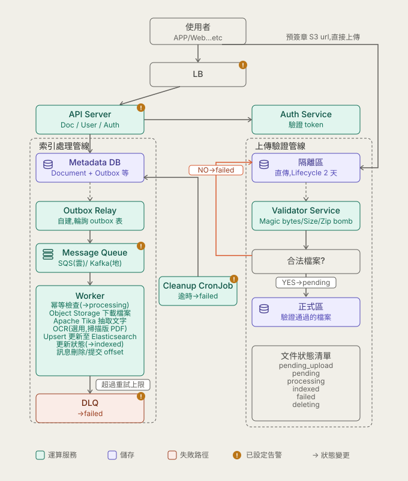

## 題目

設計一個讓使用者可以上傳、瀏覽、搜尋文字文件或書籍的後端平台。**這題不用寫實作程式碼**,重點在架構、資料流、取捨(trade-off)、失敗處理。

## 功能需求(Functional Requirements)

1. 使用者可以上傳文字檔或書籍
2. 使用者可以瀏覽或下載已上傳的文件
3. 使用者可以在自己有權限存取的文件範圍內搜尋關鍵字
4. 搜尋結果要包含:符合的文件、匹配的段落(passages)、標亮的關鍵字(highlighted keywords)
5. 使用者可以刪除文件

## 規模與效能假設(Scale and Performance Assumptions)

| 項目 | 數字 |
|---|---|
| 使用者數 | 1,000,000 |
| 文件數 | 10,000,000 |
| 平均文件大小 | 2 MB |
| 尖峰上傳速率 | 100 份/秒 |
| 尖峰搜尋流量 | 3,000 requests/秒 |
| 搜尋延遲目標 | 正常情況下 500ms 內 |
| 索引新鮮度 | 上傳後 5 分鐘內要可被搜尋到 |

(換算:總文件資料量至少 10,000,000 × 2MB ≈ 20TB)

## 可靠性與安全需求(Reliability and Security Requirements)

- 文件處理可能是非同步的,而且可能會被重試(retry)
- **重試不能造成重複文件、也不能造成重複的搜尋索引**(幂等性要求)
- 使用者絕對不能看到自己沒有權限存取的文件
- 系統要能容忍個別 service 或 worker 故障
- 刪除文件之後,儲存內容跟可搜尋的索引資料**最終**(eventually)都要被移除

## 要涵蓋的主題(Topics to Cover)

- API 設計與核心資料模型
- 文件儲存與 metadata 儲存
- 上傳與非同步處理管線(pipeline)
- 訊息佇列、重試、幂等性、死信佇列(dead-letter handling)
- 搜尋索引,以及資料庫跟搜尋引擎之間的一致性
- 授權與權限過濾(authorization / permission filtering)
- 應用服務、worker、搜尋基礎設施各自怎麼擴展(scaling)
- 容器化與 Kubernetes 部署考量
- 監控、日誌、指標、追蹤(tracing),以及事故調查(incident investigation)

## 討論情境(Discussion Scenarios)

1. 使用者上傳文件成功,但 30 分鐘後這份文件還是搜不到
2. Worker 在處理文件的過程中當機
3. 同一則佇列訊息被重複投遞了不只一次
4. 使用者在文件還在被索引的過程中,把它刪除了
5. 搜尋流量突然暴增為原本的 10 倍

> 面試官可能會在討論過程中即時調整或延伸需求。要清楚陳述自己的假設,並解釋為什麼選擇每一個主要元件。

---

## 系統架構


綠色是運算服務,紫色是儲存,珊瑚色是失敗/錯誤路徑;橘色驚嘆號標示監控告警設置點(LB 5xx 錯誤率、API Server 搜尋延遲、Cleanup CronJob、Message Queue consumer lag、DLQ 佇列深度)。

## API Server
### 負載平衡(Load Balancer)

- **雲端**:雲端廠商 LB(health check/ACM/WAF),非 HTTP 情境可搭配 ELB
- **地端**:自架維運,K8s 需要 `MetalLB` + `Ingress Controller`,搭配 **keepalived + VIP** 做主備

### 可擴展性(Scalability)設計

**前提**:API Server 必須無狀態(stateless)

- **雲端**:託管 Kubernetes(EKS/GKE/AKS),**HPA(Horizontal Pod Autoscaler)** + **Cluster Autoscaler** 自動擴展
- **地端**:同樣用 HPA 擴展 Pod,但節點(實體/虛擬機器)數量固定,無法動態建立新 Node,容量規劃成本較高

### API 清單(簡化版,條列)

> 不考慮使用者分群/文件分享功能,預設每個使用者獨立、只能存取自己的文件;應用場景更複雜時架構需相應調整

**Documents**
- `POST /documents` — 上傳(只送 metadata,回傳預簽章網址;帶 `Idempotency-Key`)
- `GET /documents` — 列出自己的文件(分頁,可用 `status` 篩選)
- `GET /documents/{id}` — 文件詳細資訊
- `GET /documents/{id}/download` — 下載(預簽章網址)
- `DELETE /documents/{id}` — 刪除
- `GET /documents/{id}/status` — 查詢處理狀態(`failed` 時附 `last_error`)
- `POST /documents/{id}/reprocess` — 只能對 `status=failed` 呼叫,重新排入處理佇列
- `GET /search?q=&page=&size=&cursor=` — 搜尋(深分頁用 `cursor`,對應 ES `search_after`)

**Auth(public)**
- `POST /auth/login` — 回傳 access token(JWT,exp 1 小時)+ refresh token
- `POST /auth/refresh` — 輪替制,換發新的 access token + 新的 refresh token,舊的立即失效
- `POST /auth/logout`
- `GET /auth/me`

**Users(Only ops)**
- `POST /users`、`GET /users/{id}`、`PUT /users/{id}`、`DELETE /users/{id}`(軟刪除)

**Internal(API Server → Auth Service)**
- `POST /internal/auth/verify-token` — 驗證 access token
- `GET /internal/auth/permissions?user_id=&document_id=` — 檢查是否為文件擁有者

### Access token / Refresh token 設計

- **Access token**:JWT,`exp` = 1 小時
- **Refresh token 輪替制(rotation)**:每次呼叫 `/auth/refresh`,同時換發新的 access token + 新的 refresh token,舊的立即失效,單一 token 只能成功使用一次
- **重複使用偵測(reuse detection)**:同一 refresh token 被使用超過一次視為外洩,撤銷該使用者(`family_id`)名下整批 refresh token,強制重新登入
- **絕對效期上限**:refresh token 鏈為 30 天

## 儲存檔案架構

使用服務:S3(雲端)/ MinIO(地端)

### 上傳方式:預簽章直傳,不經過 API Server 中轉

避免 API Server 處理文件儲存造成流量瓶頸,`POST /documents` 只收檔案 metadata(檔名/大小/型別),回傳預簽章網址,由 client **直接**上傳至 S3。

**S3 吞吐量**:單一 prefix 官方上限為 PUT/POST/DELETE 3,500 次/秒、GET/HEAD 5,500 次/秒,100 份/秒上傳僅用掉不到 3%。地端 MinIO 無此公開上限,吞吐量取決於自架硬體,需自行做容量規劃與壓測。

大檔案(書籍)採 **S3 Multipart Upload**,分塊上傳,單一塊失敗只需重傳該塊。

### 隔離桶(Quarantine Bucket)

檔案直傳讓 API Server 無法在落地前驗證內容(格式白名單、magic bytes、防毒掃描)。解法是預簽章網址改指向**隔離桶**,而非正式 Object Storage,驗證通過才搬移過去。

**Presigned POST 搭配 policy 條件**,由 S3 過濾不適當的使用情境:
- `content-length-range`:限制檔案大小
- `Content-Type`:限制宣稱類型只能是白名單開頭

## Validator Service 架構

1. 經由事件通知取得 bucket + key
2. 向隔離桶讀取檔案內容
3. 驗證:magic bytes、檔案大小複檢、防毒/惡意軟體掃描、zip bomb 偵測(`.docx`/`.epub` 為壓縮檔)
4. **通過**:呼叫 S3 `CopyObject` 複製到正式 Object Storage → 呼叫 `POST /internal/documents/{document_id}/validation-result` 回報 `{result: "passed"}` → 刪除隔離桶副本
5. **失敗**:呼叫 S3 `DeleteObject` 刪除隔離桶檔案 → 回報 `{result: "failed", error}`
6. **幂等**:事件通知為至少一次語意,同一 key 可能重複觸發,需先查目前狀態再處理

**觸發機制**

- **雲端**:S3 Event Notification 原生目的地有 SNS/SQS/Lambda 三種,選 **SQS**

| | SNS                | SQS(選用) | Lambda |
|---|--------------------|---|---|
| 傳遞模型 | Push,立即發給所有訂閱者     | Pull,消費者主動拉取 | Push,S3 直接觸發執行 |
| 訊息持久化 | 不持久,失敗僅有限重試        | 持久保存,不會遺失 | 不適用(無佇列緩衝) |
| 反壓(backpressure) | 無,消費端無法控制節奏        | 有,消費者自行決定拉取速度 | 無,尖峰時大量並行觸發 |
| 原生 retry/DLQ | 需另設訂閱失敗 DLQ        | 原生 `maxReceiveCount` + redrive policy | 需另設重試與 DLQ |
| 適合情境 | 同一事件 fan-out 給多消費者 | 單一消費者、需控制節奏與重試 | 極輕量、免維護常駐服務 |
| 選擇原因 | 僅一個消費者,不需發出多個      | — | 高流量下較貴,多一平台需維護 |

- **地端**:MinIO bucket notification 直接支援 **webhook**,呼叫 Validator Service HTTP endpoint,免除 SQS 這層

**隔離桶清理**:
1. 主要:`CopyObject` 成功後立即 `DeleteObject`
2. 安全網:隔離桶設 **Lifecycle Policy**(例如 2 天過期),兜底處理複製後未清理、事件遺失等情況

## Cleanup Service 架構

獨立 **Kubernetes CronJob**,不掛在任何現有服務底下,雲端(EKS)地端(自架 K8s)共用同一套。

**排程項目**:

1. **清理逾時 pending_upload**——使用者取得預簽章網址後未實際上傳,S3 Lifecycle Policy 只清 S3 物件,不清 DB 紀錄
```
每 15~30 分鐘:
  掃描 status = pending_upload 且 created_at 超過 1 小時的紀錄
  → 標記 failed(last_error = "上傳逾時")
```

2. **Outbox 積壓告警**——Outbox Relay 一旦中斷,無法自行偵測並回報,需獨立服務監控
```
每 1~5 分鐘:
  SELECT now() - MIN(created_at) FROM outbox WHERE published_at IS NULL
  → 暴露成 metric(例如 outbox_oldest_unpublished_age_seconds)
  → 超過門檻(例如 10 分鐘)觸發告警
```

3. **Metadata DB ↔ Elasticsearch 狀態比對**——Worker 可能在更新 ES 之後、寫回 `Document.status = indexed` 之前當機,或 ES 資料在復原過程中遺漏
```
每天離峰時段跑一次:
  掃描/抽樣 status = indexed 的 Document,用 document_id 反查 ES 是否存在
  → 有缺漏就記錄,標記需重新索引(重用 reprocess 機制)
```

4. **`outbox`/`audit_logs` 冷儲存歸檔**——partition 建立與到期 `DETACH` 已由 `pg_partman` + `pg_cron` 在資料庫層處理,此處只負責最後一步
```
每天跑一次:
  找出已被 pg_partman DETACH、尚未處理的舊 partition table
  → COPY 匯出成檔案,上傳到 S3(冷儲存/Glacier storage class)
  → 確認上傳成功後才 DROP TABLE,失敗則留待下一輪重試
```

之後類似的「定期掃描抓異常狀態」需求,可歸在同一類 Cleanup/Reconciliation CronJob。

## Outbox Relay 架構

輪詢式 Relay,從 Metadata DB 抽取事件發布至 Message Queue。

```sql
SELECT * FROM outbox WHERE published_at IS NULL
ORDER BY created_at LIMIT 100 FOR UPDATE SKIP LOCKED;
```

發布成功後執行 `UPDATE outbox SET published_at = now()`。`FOR UPDATE SKIP LOCKED` 讓多個 Relay 實例可以同時輪詢,互不搶同一批資料,兼顧水平擴展與容錯。

**輪詢頻率**:自適應——抓滿 `LIMIT` 代表可能有積壓,立即再查;沒抓滿才短暫休眠,可依尖峰時段調整。

## Message Queue ＆ Worker 架構

Worker 主動拉取(Pull)佇列資料,依自身處理能力控制拉取節奏,天生帶反壓(backpressure)效果。

- **SQS**:呼叫 `ReceiveMessage`,搭配 long polling(`WaitTimeSeconds` 最長 20 秒)。處理完主動呼叫 `DeleteMessage` 確認完成;未確認的話,visibility timeout 一過訊息自動變回可見,由其他 Worker 接手處理
- **Kafka**:Worker(consumer)迴圈呼叫 `consumer.poll()`,處理完主動提交 offset;多個 Worker 實例加入同一 consumer group,依 partition 分配平行處理

### Indexing Worker 完整工作清單

1. 從佇列取得訊息(`document_id`)
2. **幂等性檢查**:`status` 已為 `indexed` 就跳過(對應重複投遞情境)
3. 從正式 Object Storage 下載檔案
4. 抽取文字(Apache Tika)
5. 判斷是否為掃描版 PDF,需要則轉 OCR
6. 文件切段(chunking)
7. 建立/更新搜尋索引(`document_id` 為 ES doc id,**upsert** 保證幂等;索引帶 `owner_id`,查詢時只比對是否為自己的文件)
8. 更新 `Document.status = indexed`
9. 任一步驟失敗 → 依重試策略處理(見「DLQ」)
10. 全部成功才確認訊息完成(刪除訊息/提交 offset)

**部署平台選項**

| | 雲端 | 地端 |
|---|---|---|
| 建議 | EKS(Deployment + HPA),與 API Server/Auth Service/Validator Service 同一叢集 | 自架 Kubernetes,同上,節點數固定需自行做容量規劃 |

**各項工作的套件/服務選擇**

| 工作 | 雲端服務 | 地端/開源 |
|---|---|---|
| 文字抽取 | Apache Tika(雲端地端一致) | **Apache Tika** |
| OCR | AWS Textract / Google Document AI | **Tesseract OCR**(搭配 Tika 外掛) |
| 防毒掃描 | Amazon GuardDuty Malware Protection for S3 | **ClamAV** |
| 搜尋引擎 | **Amazon OpenSearch Service**(AWS 已無「Elasticsearch Service」,2021 年因授權爭議改用自研 fork;原廠 Elasticsearch 需走 Elastic Cloud) | 自架 Elasticsearch/OpenSearch,小規模可用 Meilisearch/Typesense |
| 摘要生成 | Amazon Bedrock(代管 LLM) | 自架開源 LLM(Ollama)或輕量抽取式摘要套件(sumy/gensim) |

## DLQ

**重試策略**:3~5 次,指數退避(例如 30s → 2min → 10min → 30min),讓暫時性問題(如 ES 短暫連不上)有時間恢復;重試耗盡才判定失敗、進 DLQ。

**SQS(內建 DLQ)**:主佇列設定 Redrive Policy(`deadLetterTargetArn` + `maxReceiveCount`),不用自行實作計數邏輯;Worker 處理失敗時不呼叫 `DeleteMessage`,訊息在 visibility timeout 後自動重新可見,超過上限自動轉入 DLQ。`ChangeMessageVisibility` 可疊加指數退避效果。

**Kafka(無內建機制,需自行實作)**:失敗時發布到獨立 retry topic(可分階段設不同延遲,例如 retry-30s/retry-5m/retry-30m),訊息 header 帶 `attempt_count`,超過上限才發到獨立 DLQ topic。

**DLQ 資料處理流程**:
1. 對 DLQ 深度(`ApproximateNumberOfMessagesVisible`)設監控告警,不等使用者回報
2. 診斷失敗原因不需翻 DLQ 原始訊息——Worker 進 DLQ 前已將原因寫入 `Document.last_error`,直接查 `GET /documents?status=failed` 即可
3. 排除根因後呼叫既有的 `POST /documents/{id}/reprocess` 重新處理——不使用 SQS 原生 DLQ redrive(`StartMessageMoveTask`)直接搬回主佇列,那樣會繞過業務邏輯(狀態檢查、審計紀錄)
4. DLQ 訊息本身有保留期限(SQS 最長 14 天),但 `last_error` 已持久化在資料庫
5. 若 `last_error` 顯示是檔案本身損毀(非系統性問題),應請使用者刪除重傳,而非持續呼叫 `reprocess`

---

## Metadata DB 資料表設計

完整的 `CREATE TABLE` 語法(PostgreSQL)寫在 [`schema.sql`](./schema.sql),共 5 張:`users`、`documents`、`outbox`、`refresh_tokens`、`audit_logs`。

### 高可用與備援(Multi-AZ / Read Replica)

- **雲端**:RDS/Aurora **Multi-AZ**(自動 failover)+ 視需要加開一台 **Read Replica**(分攤 ops 查詢,使用者即時查詢一律走 primary)
- **地端**:自架 streaming replication **hot standby**(`hot_standby = on`),備援 + 讀取分攤合一
- **備份**:另外設定自動快照 + **Point-in-Time Recovery**,與 Multi-AZ/Replica 是兩套機制

### users

| 欄位 | 型別 | 說明 |
|---|---|---|
| `user_id` | UUID (PK) | |
| `email` | VARCHAR(255) | 登入帳號,唯一性見下方索引說明 |
| `password` | VARCHAR(255) | 密碼雜湊 |
| `name` | VARCHAR(255) | |
| `role` | VARCHAR(20) | `user` / `ops` |
| `deleted_at` | TIMESTAMPTZ,可為 null | 軟刪除標記,null = 帳號正常 |
| `created_at` / `updated_at` | TIMESTAMPTZ | |

索引:`email` 用**部分唯一索引**(`WHERE deleted_at IS NULL`),僅在未刪除帳號之間強制不重複,允許被刪除的信箱重新註冊。

#### 使用者刪除:軟刪除設計

`DELETE /users/{id}` 流程:設定 `deleted_at` → 撤銷所有 `refresh_tokens` → 視需求清理該使用者的文件(S3/ES)。

| 關聯表 | `ON DELETE` | 理由 |
|---|---|---|
| `refresh_tokens.user_id` | `CASCADE` | 純登入 session,無外部系統需清理 |
| `documents.owner_id` | 不設(等同 `NO ACTION`) | 文件清除牽涉 S3/ES,不能讓 `CASCADE` 繞過應用層刪除管線留下孤兒資料 |
| `audit_logs.actor_user_id` | 不設 | 稽核紀錄不應隨當事人帳號刪除而消失;`users` 走軟刪除,此外鍵實務上不會被觸發 |

`users` 這一列實際上永遠存在,`documents`/`audit_logs` 的外鍵始終有效——稽核紀錄永久保留可追溯性,文件的實際清理仍走既有、會處理 S3/ES 的應用層流程。若有法遵(GDPR 類)被遺忘權需求,可在軟刪除同時將 `email`/`name` 覆寫為匿名值,`user_id` 與所有外鍵關聯不受影響。

### documents

| 欄位 | 型別 | 說明 |
|---|---|---|
| `document_id` | UUID (PK) | |
| `owner_id` | UUID(FK → users,不設 `ON DELETE`) | 誰上傳的,權限檢查只比對此欄 |
| `filename` | VARCHAR(255) | |
| `file_size` | BIGINT | bytes |
| `content_type` | VARCHAR(100) | |
| `title` / `summary` / `publication_year` | VARCHAR / TEXT / INT | 文件詳細頁欄位,summary 可能由 Worker 自動產生 |
| `storage_key` | VARCHAR(512) | 驗證通過後,在正式 Object Storage 的 key |
| `status` | VARCHAR(20) | `pending_upload`/`pending`/`processing`/`indexed`/`failed`/`deleting` |
| `last_error` | TEXT | `status=failed` 時的失敗原因 |
| `idempotency_key` | VARCHAR(255) UNIQUE | 對應 `POST /documents` 的 `Idempotency-Key` header |
| `created_at` / `updated_at` | TIMESTAMPTZ | |

索引:`(owner_id, status)` 支援 `GET /documents?status=` 查詢;`(status, created_at)` 支援 Cleanup CronJob 掃描逾時的 `pending_upload`。

### outbox

| 欄位 | 型別 | 說明 |
|---|---|---|
| `id` | BIGSERIAL(PK,`(id, created_at)`) | |
| `aggregate_id` | UUID | 通常是 `document_id` |
| `event_type` | VARCHAR(100) | 例如 `document.pending`、`document.reprocess` |
| `payload` | JSONB | 送進 Message Queue 的實際內容 |
| `created_at` | TIMESTAMPTZ | |
| `published_at` | TIMESTAMPTZ,可為 null | null 代表尚未被 Outbox Relay 發送 |

索引:對 `published_at IS NULL` 建部分索引(partial index),對應 Relay 輪詢查詢,不隨全表資料量變大而變慢。

**分區與冷儲存**:按 `created_at` 做 **RANGE Partition**,每月一個 partition(PK 相應為 `(id, created_at)`,partition key 必須包含在 PK 裡)。部分索引宣告在父表上,PostgreSQL 11+ 自動套用到每個現有/未來的 partition。

Partition 的建立與過期清理交由資料庫原生機制自動處理,不需應用層自行排程(見 [`schema.sql`](./schema.sql) 與 [`migrations/20240101000000-create-initial-schema.js`](./migrations/20240101000000-create-initial-schema.js)):
- **`pg_partman`**:提前建好未來 3 個月的 partition(`p_premake => 3`),保留期限設定 30 天
- **`pg_cron`**:每小時排程呼叫一次 `partman.run_maintenance()`,維護邏輯全部活在 Postgres 內部
- `retention_keep_table = true`:`pg_partman` 到期時只 `DETACH`、不自動刪除,「匯出到 S3 冷儲存 → 確認成功後才 `DROP TABLE`」交由 Cleanup Service 執行
- **前提**:`pg_cron` 需在資料庫啟動時就載入 `shared_preload_libraries = 'pg_cron'`(伺服器層級設定,雲端為 RDS/Aurora parameter group + reboot,地端為 `postgresql.conf` + 重啟),需在資料庫佈建階段設定好,非 migration 可完成

### refresh_tokens

| 欄位 | 型別 | 說明 |
|---|---|---|
| `token_id` | UUID (PK) | |
| `user_id` | UUID(FK → users,`ON DELETE CASCADE`) | |
| `family_id` | UUID | 同一條登入鏈路(輪替鏈)共用,重複使用偵測時整批撤銷用這欄 |
| `token_hash` | VARCHAR(255) | 只存 hash |
| `used_at` | TIMESTAMPTZ,可為 null | 已被換發過就有值;若已有值又被使用一次 = 偵測到重複使用 |
| `revoked_at` | TIMESTAMPTZ,可為 null | 登出或偵測到重複使用時撤銷 |
| `expires_at` | TIMESTAMPTZ | 絕對效期上限(建立時 + 30 天) |
| `created_at` | TIMESTAMPTZ | |

索引:除 `family_id`、`user_id` 外另對 **`token_hash` 建索引**——`/auth/refresh` 核心查詢路徑是用使用者帶來的 token 反查這筆紀錄,沒有這個索引會是全表掃描。

### audit_logs

| 欄位 | 型別 | 說明 |
|---|---|---|
| `log_id` | BIGSERIAL(PK,`(log_id, created_at)`) | |
| `actor_user_id` | UUID(FK → users,不設 `ON DELETE`) | 誰做的(通常是維運人員) |
| `action` | VARCHAR(100) | 例如 `view_document`、`delete_user` |
| `target_type` | VARCHAR(50) | 例如 `document`、`user` |
| `target_id` | UUID | |
| `created_at` | TIMESTAMPTZ | |

**分區與冷儲存**:跟 `outbox` 一樣按 `created_at` 做 RANGE Partition,同套 `pg_partman` + `pg_cron` 自動維護。這張表是持續 append 的稽核紀錄,保留期限抓長一點(`retention = '13 months'`),同樣設 `retention_keep_table = true`,到期只 `DETACH`,匯出 S3/Glacier 冷儲存後由 Cleanup Service 執行 `DROP TABLE`。

### Migration 與 Seed

用 **Sequelize + sequelize-cli** 管理 schema 版本與預設資料。

```bash
cp .env.example .env        # 設定 DATABASE_URL、SEED_OPS_PASSWORD
npm run migrate:up          # sequelize-cli db:migrate,建出 5 張表
npm run seed                # sequelize-cli db:seed:all,塞入預設 ops 帳號
npm run migrate:down        # sequelize-cli db:migrate:undo,需要的話可以整個回滾
```

- `migrations`:只有一個檔案([`20240101000000-create-initial-schema.js`](./migrations/20240101000000-create-initial-schema.js)),`up()` 直接讀取並執行 [`schema.sql`](./schema.sql) 本身,不在 migration 裡重複寫一份幾乎一樣的建表邏輯——`schema.sql` 是唯一的 schema 真實來源,兩邊內容才不會慢慢跑掉。`down()` 沒辦法從 schema.sql 自動反推,手動寫反向的 `DROP`
- `seed`:建立預設的維運使用者

---

## 技術選型對照與成本估算(雲端 vs 地端)

### 服務/元件技術對照表

| 服務/元件 | 雲端 | 地端 |
|---|---|---|
| 負載平衡 | ALB/NLB(health check、ACM、WAF) | MetalLB + Ingress Controller + keepalived + VIP |
| API Server 部署 | EKS/GKE/AKS + HPA + Cluster Autoscaler | 自架 Kubernetes + HPA(節點數固定) |
| 物件儲存 | Amazon S3(隔離桶、正式儲存、冷儲存皆用 S3,搭配 Glacier storage class) | MinIO(自架,隔離桶/正式儲存/冷儲存皆為獨立 bucket) |
| 隔離桶事件通知 | S3 Event Notification → SQS | MinIO bucket notification → webhook,直打 Validator Service |
| Validator Service 部署 | EKS,同 API Server 叢集 | 自架 K8s,同上 |
| 防毒掃描 | Amazon GuardDuty Malware Protection for S3 | ClamAV |
| Metadata DB | RDS/Aurora PostgreSQL,Multi-AZ + 視需要加 Read Replica | 自架 PostgreSQL + streaming replication hot standby |
| Partition 維護 | `pg_partman` + `pg_cron`(RDS/Aurora 皆支援) | 同左,自架時設定更自由 |
| DB 備份 | RDS 自動快照 + Point-in-Time Recovery | `pg_basebackup` + WAL 歸檔 |
| Outbox Relay | 自建輪詢服務,跑在 EKS | 同左,跑在自架 K8s |
| Message Queue | Amazon SQS | 自架 Kafka |
| Indexing Worker 部署 | EKS,同 API Server 叢集 | 自架 K8s,同上 |
| 文字抽取 | Apache Tika | Apache Tika(相同) |
| OCR | AWS Textract | Tesseract OCR |
| 搜尋引擎 | Amazon OpenSearch Service | 自架 Elasticsearch/OpenSearch |
| 摘要生成(選用) | Amazon Bedrock | 自架 LLM(Ollama)或抽取式摘要套件(sumy/gensim) |
| 監控/告警 | CloudWatch + SNS | Prometheus + Grafana + Alertmanager |
| 追蹤(Tracing) | OpenTelemetry → AWS X-Ray | OpenTelemetry → Jaeger/Zipkin |

### 雲端成本估算(依本題規模概算,非報價)

依規模假設(1,000,000 使用者、10,000,000 文件、總資料量約 20TB、尖峰 100 上傳/秒、尖峰 3,000 搜尋/秒),用美東區域概略牌價逐項試算月費量級。以下計算式為簡化示範,省略部分明細(例如確切 IOPS 費用),用意是展示估算邏輯而非精確報價。

**1. S3 正式儲存**
```
20,000 GB × $0.023/GB(S3 Standard) = $460/月
```
隔離桶(檔案存活時間短,通常幾秒到幾天)+ 冷儲存(遠小於正式資料量)兩者合計估 **~$10/月**。

**2. RDS PostgreSQL(Multi-AZ)+ Read Replica**

假設機型 `db.r6g.xlarge`(4 vCPU / 32GB RAM),單一實例約 $0.504/小時:
```
Multi-AZ 運算 = $0.504/hr × 2(雙實例同步複寫) × 730 hr/月 ≈ $736/月
儲存(500GB gp3,Multi-AZ 兩份都計費)= 500GB × 2 × $0.115/GB ≈ $115/月
Multi-AZ 小計 ≈ $851/月

Read Replica(單一實例,不含 Multi-AZ)
= $0.504/hr × 730 hr + 500GB × $0.115/GB
≈ $368 + $58 ≈ $426/月
```
DB 層合計 **≈ $1,277/月**。

**3. Amazon OpenSearch Service**——成本占比最大,拆最細:
```
① 估算索引資料量:
   平均文件 2MB,實際抽取出的純文字通常遠小於原始檔案(格式/圖片開銷),
   概估抽取後文字約占原檔 10% → 平均 200KB/份
   10,000,000 份 × 200KB ≈ 2,000,000,000 KB ≈ 1.9TB(原始文字)

② 索引膨脹係數:
   ES/OpenSearch 為支援 highlight 需要儲存詞位置等資訊,索引通常比原文大,
   概估膨脹係數 1.5x → 1.9TB × 1.5 ≈ 2.9TB(主分片)

③ 加 1 份 replica shard(高可用)→ 總儲存 ≈ 2.9TB × 2 ≈ 5.8TB

④ 節點數:需同時滿足儲存量與尖峰 3,000 qps 的運算/併發需求,
   估 8 個資料節點(r6g.xlarge.search,4 vCPU/32GB,約 $0.335/hr,各配 1TB EBS)
   + 3 個 master 節點(m6g.large.search,約 $0.16/hr)

資料節點運算 = 8 × $0.335/hr × 730hr ≈ $1,956/月
Master 節點運算 = 3 × $0.16/hr × 730hr ≈ $350/月
EBS 儲存 = 8 × 1,000GB × $0.122/GB ≈ $976/月

OpenSearch 合計 ≈ $1,956 + $350 + $976 ≈ $3,282/月
```

**4. EKS 運算(API Server / Validator Service / Indexing Worker / Outbox Relay 共用叢集)**
```
Control plane = $0.10/hr × 730hr = $73/月
節點群:估平均 8 個節點(m6g.xlarge,4 vCPU/16GB,約 $0.154/hr,
        已反映 HPA/Cluster Autoscaler 依尖峰動態擴縮後的平均值)
= 8 × $0.154/hr × 730hr ≈ $899/月

EKS 合計 ≈ $73 + $899 ≈ $972/月
```

**5. SQS**
```
假設平均上傳速率為尖峰的 10%(100/秒 × 10% = 10/秒),
每份文件平均產生 2 則訊息(隔離桶驗證事件 + 主索引事件)
月訊息量 = 10/秒 × 2 × 2,592,000 秒/月 ≈ 5,184 萬則

SQS 費用 = 51.84(百萬則) × $0.40/百萬則 ≈ $21/月
```

**6. CloudWatch 監控/日誌**
```
估 500 個自訂 metric × $0.30/metric/月 ≈ $150/月
日誌擷取量估 50GB/月 × $0.50/GB ≈ $25/月
CloudWatch 合計 ≈ $175~200/月
```

**彙總(us-east-1 牌價)**

| 項目 | 月費估算(USD) |
|---|---|
| S3(正式 + 隔離桶 + 冷儲存) | ~$470 |
| RDS Multi-AZ + Read Replica | ~$1,277 |
| Amazon OpenSearch Service | ~$3,282 |
| EKS 運算 | ~$972 |
| SQS | ~$21 |
| CloudWatch | ~$200 |
| 其他(KMS、NAT Gateway、資料傳輸等,概估) | ~$200 |
| **合計(us-east-1)** | **約 $6,400/月** |


### 地端成本估算

地端是一次性資本支出(CapEx)+ 長期維運支出(OpEx)的組合。

**硬體 CapEx**

| 項目 | 規格概估 | 數量 | 單價概估 | 小計 |
|---|---|---|---|---|
| K8s 運算節點 | 雙 CPU、128GB RAM(承載 API/Validator/Worker/Relay) | 3 台 | $8,500 | $25,500 |
| PostgreSQL DB 主/備機 | 高頻 CPU、64~128GB RAM、NVMe SSD | 2 台 | $10,200 | $20,400 |
| MinIO 儲存節點 | 多顆大容量硬碟,erasure coding 需 ~1.5~2 倍於 20TB 可用容量 | 4 台 | $8,500 | $34,000 |
| Elasticsearch/OpenSearch 節點 | 大記憶體、NVMe SSD(承載全文索引 + 尖峰查詢) | 4 台 | $12,750 | $51,000 |
| 網路設備/負載平衡 | 交換器、LB 硬體或軟體 LB 節點 | — | — | $12,750 |
| 監控主機(Prometheus/Grafana) | 中規格伺服器 | 1~2 台 | — | $6,800 |
| **CapEx 合計**(較品牌機約打 85 折) | | | | **≈ $150,000** |

```
攤提(以 4 年/48 個月折舊):
$150,000 ÷ 48 個月 ≈ $3,125/月
```

**OpEx(依台灣實際條件調整,逐項列算式)**

**1. 機房/電力**
```
伺服器數量:3(K8s)+ 2(PostgreSQL)+ 4(MinIO)+ 4(ES)+ 2(網路/監控)≈ 15 台
機架空間:平均 2U/台 × 15 台 ≈ 30U,加交換器/配線預留,2 個機櫃(42U/櫃)較有彈性
機櫃租金 = 2 櫃 × NT$18,000/櫃/月 ≈ NT$36,000/月

用電:概估平均每台 400W × 15 台 = 6,000W = 6kW
台灣 IDC 電力行情約 NT$4,000/kW/月(依迴路計費)
電費 = 6kW × NT$4,000/kW ≈ NT$24,000/月

機房/電力合計 ≈ NT$36,000 + NT$24,000 ≈ NT$60,000/月 ≈ $1,935/月
```

**2. 對外頻寬**
```
上傳是頻寬需求的主要驅動:尖峰 100 份/秒 × 平均 2MB/份 = 200MB/秒 = 1.6Gbps(理論尖峰)
實務上不會用「絕對尖峰」簽委外頻寬合約,通常抓可持續負載(估尖峰的 40~50%)、
估委外頻寬約需 800Mbps~1Gbps 等級
伺服器已放在機房代管(colo),頻寬走機房業者的商用頻寬方案
約 NT$30,000~40,000/月
估 NT$35,000/月 ≈ $1,129/月
```

**3. 維運人力**
```
1 FTE 年薪 NT$1,000,000 ÷ 12 個月 = NT$83,333/月(全職月薪,含薪資+福利+管銷)
估需 0.5 位全職平台/SRE 工程師心力:
NT$83,333 × 0.5 ≈ NT$41,667/月 ≈ $1,344/月
```

**彙總**

| 項目 | NTD/月 | USD/月 |
|---|---|---|
| 機房/電力 | NT$60,000 | ~$1,935 |
| 對外頻寬 | NT$35,000 | ~$1,129 |
| 維運人力 | NT$41,667 | ~$1,344 |

```
地端月成本(攤提 CapEx + OpEx,台灣條件)
≈ $3,125(攤提硬體)+ $1,935(機房電力)+ $1,129(頻寬)+ $1,344(人力)
≈ $7,533/月(約 NT$233,500/月)
```

**注意事項與結論**:
- 硬體單價、機房費率、頻寬費率皆為示範性數量級,實際會因供應商、合約規模、用電量而有落差
- 地端隨規模成長的邊際成本會逐漸遞減(硬體攤提完畢後只剩機房 + 頻寬 + 人力),流量持續成長且拉長到 4 年以上的情況下,地端的相對優勢會更明顯


